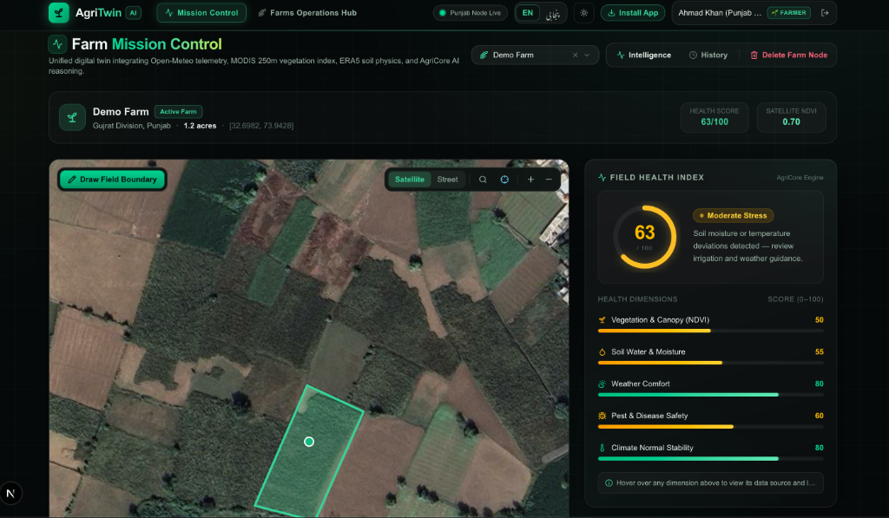

# AgriTwin — Agricultural Digital Twin Platform

[](https://fastapi.tiangolo.com)
[](https://nextjs.org)
[](https://www.typescriptlang.org)
[](https://tailwindcss.com)
[](https://opensource.org/licenses/MIT)

> **Precision Agriculture & Digital Twin Platform for Pakistan's Agricultural Heartlands**  
> Integrates satellite vegetation observations, real-time agrometeorology, Saxton-Rawls soil hydraulics, canal rotational rights (Warabandi), and thermal crop phenology into a bilingual Punjabi/English decision-support system for farmers and agricultural extension officers.

---

## Platform Interface


*AgriTwin Mission Control: Interactive GIS parcel boundary mapping in Gujrat Division, live Punjab node telemetry beacon, and 5-dimension Field Health Index.*

---

## Core Capabilities

- **Satellite Vegetation Monitoring**: Tracks 12-month NASA MODIS Terra (MOD13Q1) NDVI time-series with historical canopy comparisons.
- **Live Agrometeorology**: Real-time 2m temperature, relative humidity, precipitation, and FAO-56 Reference Evapotranspiration (ET0) via Open-Meteo.
- **Warabandi Canal Irrigation Optimizer**: Models Punjab's weekly canal rotational schedules, calculates turn countdowns, and advises when to hold diesel tubewell pumping to save costs (Rs. 1,400–2,200/hr).
- **Soil Physics & Moisture Engine**: Implements Saxton-Rawls pedotransfer equations for field capacity, wilting point, plant available water capacity, and hydraulic conductivity, integrated with ISRIC SoilGrids 2.0.
- **GDD Thermal Phenology**: Base-temperature calibrated Growing Degree Day accumulation tracking crop growth stages and warning of Terminal Heat Stress during grain filling.
- **Punjab Smog & AQI Monitoring**: Real-time PM2.5 and PM10 air quality indices (Copernicus CAMS / Open-Meteo) with crop hazard indicators.
- **Dual-Persona Operational Modes**:
  - **Farmer Mode**: Individual farm parcel tracking, diesel tubewell savings calculations, crop logs, and full management controls.
  - **Extension Officer Mode**: Multi-district regional surveillance banner (Directorate General of Agriculture Extension Punjab), district-wide plot overview, and locked field deletion for audit safety.
- **Security & Auth Architecture**: Mandatory Login-on-Start AuthGuard, zero sensitive tokens stored in browser localStorage, and support for HttpOnly session cookies.
- **Native Punjabi & English Localization**: Complete UI localization in authentic Punjabi (Shahmukhi / پنجابی) and English, with RTL typography and local crop/stage terminology.

---

## Technical Changes & Improvements

### 1. User Interface & Layout
- **Cleaned Desktop Header**: Moved About Platform and API Docs to the global footer to give the top navigation breathing room. The header focuses on primary operational controls: Mission Control, Farms Operations Hub, live node status beacon, language toggle, theme toggle, and authenticated user profile.
- **Global Footer (Footer.tsx)**: Added a persistent footer across all routes containing quick navigation links, Swagger REST documentation link, and scientific data attribution (Open-Meteo, NASA MODIS, ISRIC).
- **Bilingual About Page (/about)**: Created an informative platform overview covering the Indus Basin water challenge, core scientific engines, dual operational personas, and team contributor profiles.
- **Streamlined Login Experience**: Replaced large cards on the login page with low-key 1-tap demo shortcuts (`[ Farmer (Ahmad) -> ]` and `[ Officer (Dr. Tariq) -> ]`), along with an account role selector for custom registrations.
- **Responsive Mobile Drawer**: Preserved full navigation access on mobile devices through an interactive slide-out drawer.

### 2. Agricultural Logic & Core Engines
- **Warabandi Canal Scheduler (warabandi_engine.py)**:
  - Maps geographical coordinates to Punjab canal commands (Lower Bari Doab, Upper Chenab, Sidhnai, Fordwah, etc.).
  - Calculates exact weekly turn start/end times and live countdowns.
  - Integrates 7-day rainfall forecasts: if rain is imminent or a canal turn is upcoming, advises farmers to pause tubewell pumping, estimating saved diesel expenditures.
- **Growing Degree Day (GDD) Pipeline (gdd_engine.py)**:
  - Uses crop-specific base temperatures: 4.4°C (Wheat), 15.6°C (Cotton), 10.0°C (Rice & Maize), and 18.0°C (Sugarcane).
  - Tracks accumulated heat units to evaluate physiological maturity independently of calendar days.
  - Flags Terminal Heat Stress when temperatures exceed 34°C during reproductive and grain filling stages.
- **Dynamic Phenology Synchronization**:
  - Automatically recalculates growth stages when viewing farm crops based on elapsed days since sowing.

### 3. Data Accuracy & Scientific Grounding
- **Saxton-Rawls Soil Hydraulics (soil_engine.py)**:
  - Replaced rough texture estimates with established Saxton-Rawls pedotransfer equations.
  - Calculates saturated moisture, field capacity (33 kPa), permanent wilting point (1500 kPa), plant available water capacity (AWC), and saturated hydraulic conductivity (Ks).
  - Maps sand, silt, and clay fractions to USDA soil texture classes and authentic Punjabi classifications (میرا, چکنی مٹی, ریتلی).
  - Connects to ISRIC SoilGrids 2.0 with regional fallback profiles for central and southern Punjab.
- **Reliable Live Telemetry Beacon**:
  - Implemented continuous 10-second background polling for `/api/v1/health` with unmount cleanup in `HeaderNav.tsx`, ensuring the live node beacon accurately reflects backend connectivity.

### 4. Security Hardening & Deployment Readiness
- **Mandatory Login-on-Start (AuthGuard.tsx)**:
  - Unauthenticated visitors hitting `/` or protected routes are automatically redirected to `/login`.
  - Authenticated visitors visiting `/login` are forwarded directly to `/`.
  - The `/about` page remains publicly accessible.
  - Branded loading radar prevents UI flashes while verifying session state.
- **Elimination of localStorage Token Storage (AuthProvider.tsx)**:
  - Removed JWT tokens and user data from `localStorage` to protect against XSS token exfiltration.
  - Purges any legacy keys from `localStorage` on initial mount.
  - Authentication sessions are handled through secure cookies (`SameSite=Lax`, `Path=/`, `Secure` in production) combined with an in-memory `AuthContext`.
- **Backend HttpOnly Cookies (auth.py)**:
  - `POST /api/v1/auth/login` and `POST /api/v1/auth/register` set an `HttpOnly` `agri_session` cookie in addition to returning Bearer tokens.
  - Dependencies (`get_current_user`, `get_optional_current_user`) extract identity from either the Authorization header or the session cookie.
  - Added `POST /api/v1/auth/logout` endpoint to clear the session cookie.
- **Role-Based Access Control (RBAC)**:
  - Farm creation assigns `user_id = user.id`.
  - Extension Officers are restricted with HTTP 403 if attempting to delete farm parcels, ensuring audit integrity.

---

## Architecture & Project Structure

```
AgriTwin/
├── backend/                  # FastAPI REST API (Python 3.12)
│   ├── app/
│   │   ├── main.py           # Application entrypoint, CORS, lifespan demo seeding
│   │   ├── database.py       # SQLAlchemy engine & session management
│   │   ├── models.py         # Database models (User, Farm, Crop, etc.)
│   │   ├── schemas/          # Pydantic validation schemas
│   │   └── routers/          # Route handlers (auth, farms, analytics, intelligence, weather)
│   ├── tests/                # Automated pytest suite (20 tests)
│   └── requirements.txt      # Python dependencies
├── data-engine/              # Scientific & Agronomic Modeling Engines
│   ├── agricore.py           # 5-dimension health scoring & agronomy rules
│   ├── warabandi_engine.py   # Canal schedule solver & diesel savings estimator
│   ├── soil_engine.py        # Saxton-Rawls hydraulics & ISRIC SoilGrids
│   ├── gdd_engine.py         # Growing Degree Day phenology & heat stress
│   └── crop_knowledge.py     # Crop calendars, base temperatures, and DAS tables
├── frontend/                 # Next.js 16 Web Application (App Router)
│   ├── src/
│   │   ├── app/              # Routes: / (Dashboard), /login, /about, /farms, /farms/[id]
│   │   ├── components/       # UI components (HeaderNav, Footer, AuthProvider, AuthGuard, FarmMap)
│   │   └── lib/              # API client, Punjabi translations, types, and unit tests
│   └── package.json          # Frontend dependencies & test scripts
└── README.md
```

---

## Local Development Setup

### Prerequisites
- Python 3.11 or 3.12
- Node.js 18+ and `npm`

---

### 1. Backend Setup

```bash
cd backend

# Create and activate virtual environment
python3 -m venv .venv
source .venv/bin/activate

# Install dependencies
pip install -r requirements.txt

# Run backend tests to verify environment
PYTHONPATH=../data-engine:app:backend pytest tests/ -v

# Start FastAPI server
PYTHONPATH=../data-engine uvicorn app.main:app --host 127.0.0.1 --port 8000 --reload
```

Interactive API documentation: **[http://localhost:8000/docs](http://localhost:8000/docs)**.

---

### 2. Frontend Setup

```bash
cd frontend

# Install dependencies
npm install

# Run TypeScript check and unit tests
npx tsc --noEmit && npm test

# Start Next.js development server
npm run dev
```

Open your browser at: **[http://localhost:3000](http://localhost:3000)**.

---

## Testing & Quality Assurance

AgriTwin maintains test coverage across both backend services and frontend utilities:

```bash
# 1. Run Backend Pytest Suite (20 automated tests)
# Validates health checks, cookie auth, farm CRUD, Warabandi, soil physics, and phenology
cd backend
PYTHONPATH=../data-engine:app:backend pytest tests/ -v

# 2. Run Frontend Test Suite
# Validates English-to-Punjabi translation key parity and crop name/stage localization
cd frontend
npm test

# 3. Test Production Build
npm run build
```

---

## External Data Feeds & Attribution

| Feed | Provider | Coverage | Parameters |
|---|---|---|---|
| **Meteorology** | [Open-Meteo](https://open-meteo.com) | Real-time & 7-Day Forecast | Temperature, Humidity, Rain, Wind, ET0 |
| **Soil Physics** | Open-Meteo / ECMWF IFS | Topsoil Layer | Soil moisture (0–7 cm), Soil temperature |
| **Air Quality** | Copernicus CAMS / Open-Meteo | Punjab Grid | PM2.5, PM10 Smog indices |
| **Orbital Imagery** | NASA MODIS Terra (MOD13Q1) | 16-Day Composite | 250m NDVI & EVI vegetation indices |
| **Soil Texture** | [ISRIC SoilGrids 2.0](https://soilgrids.org) | 250m Global Grid | Sand, Silt, Clay fractions, Organic matter |
| **Climate Normals** | NASA POWER (MERRA-2) | 30-Year Historical | Baseline temperature & precipitation deviations |

---

## Localization

AgriTwin provides native **Punjabi (پنجابی / Shahmukhi)** localization alongside English:
- Full coverage across UI controls, labels, indicators, charts, and modals.
- Crop names in local dialect: *کنک (Wheat), چاول (Rice), پھٹی (Cotton), گنا (Sugarcane), چھلی (Maize)*.
- Agricultural growth stages: *اگاؤ (Emergence), شگوفے (Tillering), گنڈھ بننا (Jointing), گوپھ (Booting), بور (Flowering), دانہ بھرائی (Grain Filling), پکائی (Maturity)*.
- Toggle anytime via the `ENG / پنجابی` button with persistent language preference and RTL layout styling.

---

## License

This project is open-source under the [MIT License](LICENSE).
